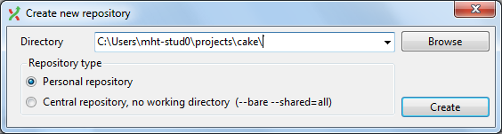
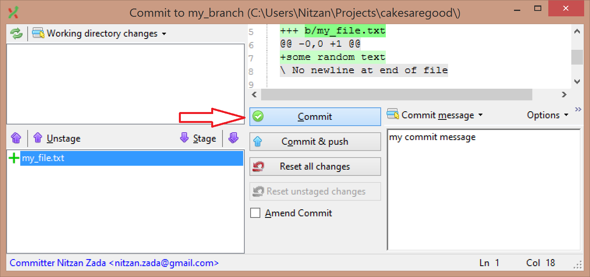
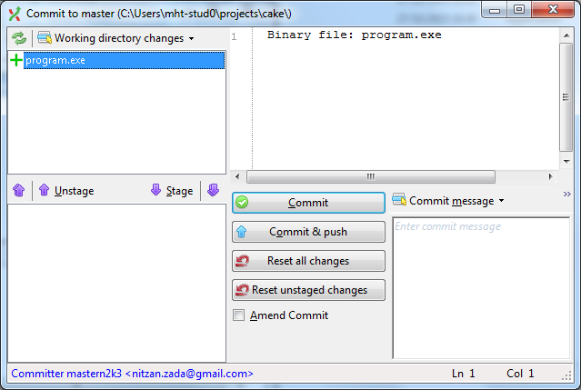

Basics with Console
-------------------

### Initializing a local repo

Whenever we start a new project from scratch or have an existing project and just want to turn it into a repository.

1. Initialize a new repo,  
    Use "Start" -> "Create new repository..."

    

2. Create two new files.

3. Stage (add it to the index) and commit them.

    

4. Make changes to one of the files.

5. Stage (add it to the index) and commit the new changes.

### Branches, creating and switching

Given an existing repository, creating a new feature branch, switching to and working on it.

1. Create a new branch called `cool_new_feature`.

2. Switch to that branch (make sure you have no unstaged changes).  
	*Swithing branches while having unstaged changes will keep those changes after switching by default.*

3. Create a new file named `feature_file.cpp`, stage and commit it.

4. View the difference between the new branch you're currently on and the original one (`cool_new_feature` and `master`).

### Ignoring files with the `.gitignore` file

How to tell git to ignore certain files, like build artifacts, temporary backup files and whole folders.

1. Navigate the command line to the repo folder.

2. Create a new file named `program.exe`.

3. Check the commit window, notice the new pending file.

    

4. Create a `.gitignore` file and use it to ignore all `.exe` files.

5. Check the commit window again, notice that GitExtensions no longer sees it as a pending change.

### Current authoring user and email
