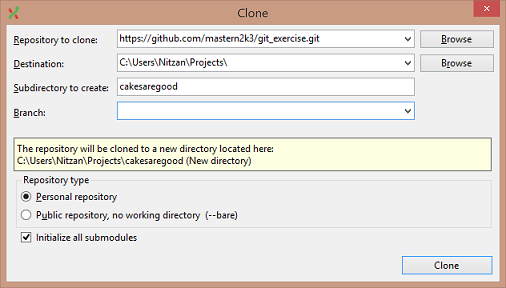
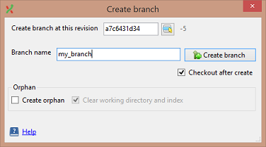
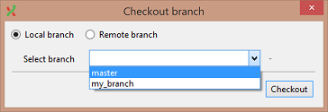

Working with Branches
--------------------

### Cloning a repo and making off-site changes

Whenever we have a remote repository that we'd like to have a copy of, and possibly start uploading changes to.

1. Clone this remote repository:  
    `https://github.com/mastern2k3/git_exercise.git`

    

2. Create a new branch called `my_branch`,  
    Use "Commands" -> "Create Branch..."

    

3. Create, stage and commit a new file to `my_branch`.

### Rebasing my branch back on top of the `master` branch

Whenever the main branch has progressed after our feature branch and we want to make
it consistent with the latest changes.

1. Use the same repo from the previous exercise.

2. Switch back to the `master` branch,  
    *Notice the file we created earlier disappeared?*  
    Use "Commands" -> "Checkout branch..."

    

    Or just use the dropbox from the tool bar

3. Create, stage and commit a new file to `master`.

    

    Now the `my_branch` branch is rooted behind the `master` branch.

4. Switch back to the `my_branch` branch.

5. Rebase it back on top of the `master` branch.

    

6. Now the commits are neatly ordered.

    

### Merging off-site changes back into the `master` branch

When we're done working and we'd like to merge new commits back into the originating branch.

1. Use the same repo from the previous exercise.

2. Switch to the branch we want to **merge changes into** (`master`).

3. Merge `my_branch` back into `master`,  
    Use "Commands" -> "Merge branches..."

    

4. Now `master` is aligned back together with the new commits from `my_branch`.

    
