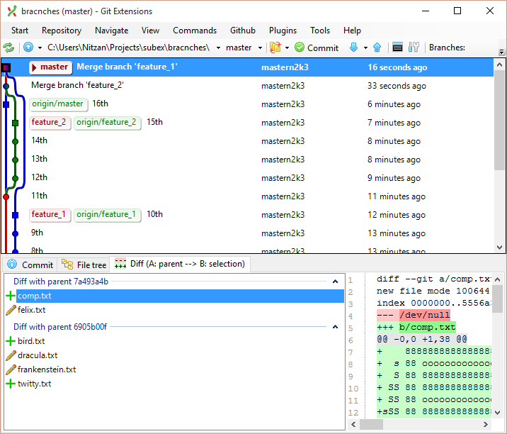
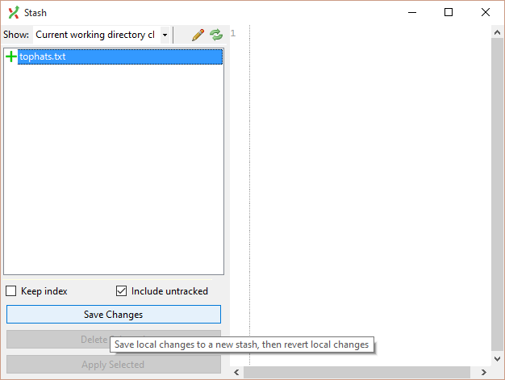
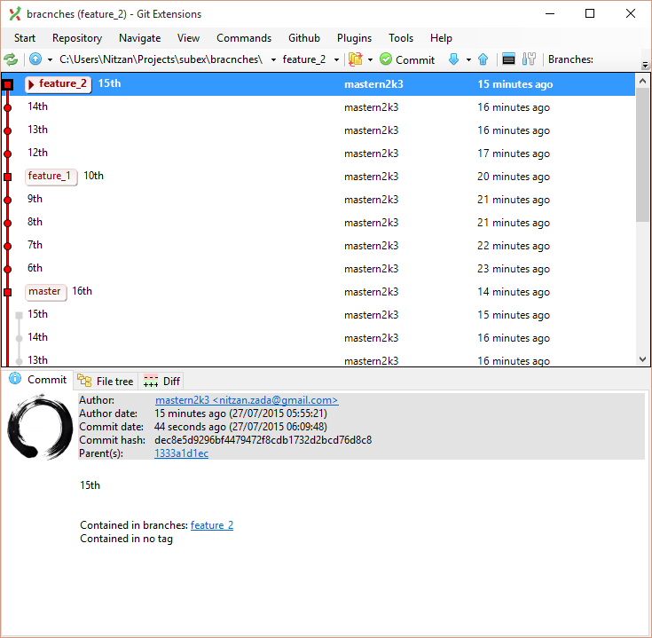

Branches Scenarios
==================

Lets re-explore merging and manipulating branches and see the difference between merging and rebasing.

### Joining with a merge

First lets see how the join merge solution looks like.

1. Clone the `branches` repo.

2. Merge the `feature_2` branch into `master`.

3. Merge the `feature_1` branch into `master`.

4. Notice how the commit log looks like right now?

    It should look something like this:

    

### Creating pending changes and stashing them before we move on

1. Use the repo from the earlier exercise.

2. Copy the `tophats.txt` file from the `git_exercise` repo.

3. Now you have pending changes!

4. Stash these pending changes for later use  
    Use "Commands" -> "Stash changes..."

    

### Rebasing everything neatly

Now lets see how things look when we stack them nicely using a rebase.

1. Use the repo from the earlier exercise.

2. Reset the merges you made when you joined the two features.

2. Re-merge the `feature_1` branch neatly into `master` using a rebase.

3. Re-merge the `feature_2` branch neatly into `master` using a rebase.

4. Notice how the commit log looks like right now?

    It should look something like this:

    

### Fetching the changes we stashed away and committing them

Now when the coast is clear and we have the workspace how we want it, we can pop the changes we put in the stash and commit them.

1. Use the repo from the earlier exercise.

2. Pop the changes you placed in the stash.

3. Commit the new changes on top of your neatly ordered branch.
