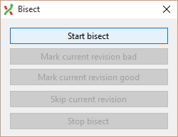
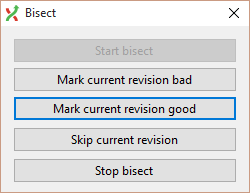

Fixing Mistakes
===============

### Using Git bisect to locate a bug

1. Clone the `sad_story` repo locally.

2. Select all commits you want to run bisect for.

3. Start the bisect process.
    Use "Commands" -> "Bisect..."

    

4. Mark and test either good revision or bad revision.

    

2. Repeat until you find the buggy commit.

### Using patches

1. Clone the exercise repo (yes again ☺).

2. Create a patch from the commit you made in the cherry picking exercise.

3. Apply that patch to the exercise repo you just cloned.

4. Commit the new changes.
