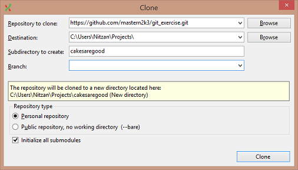
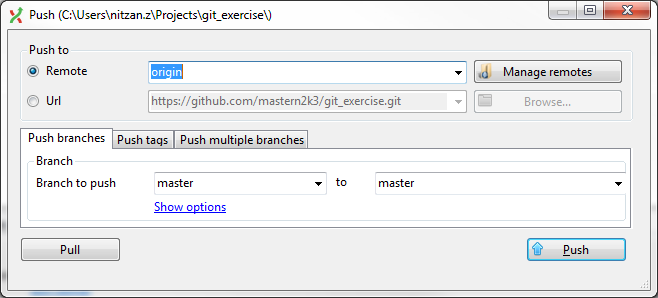
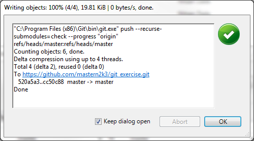
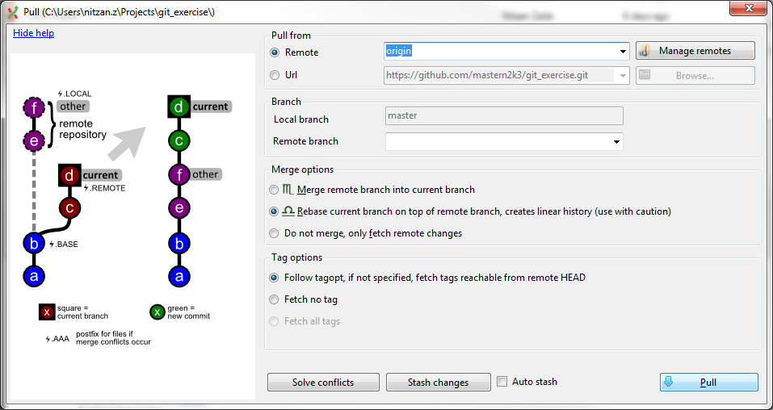
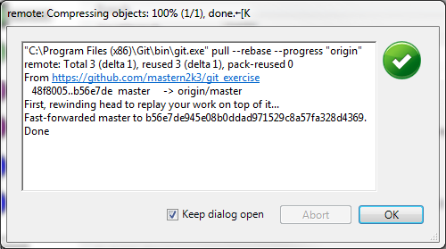

Working with Remotes
--------------------

For this exercise you're going to need a repo with write permissions, so in case you have one use it.
If not, in the last page I'll show you how to fork the one I created in GitHub so you could write to it.

### Cloning a remote repo and pushing changes

1. Clone your remote repository as you did in the branches, only now - **use your own**:  
    `https://github.com/<your_username_here>/git_exercise.git`

    

2. Create, stage and commit a new file.

3. Push those changes to the originating repo,  
    Use "Commands" -> "Push..." *(available also from the toolbar)*.

    

4. Depending on the remote repo you'll be prompted for different information but the end result should look something like this:

    

### Pulling new changes from a remote repo

Whenever the remote repo has progressed beyond our local clone.

1. Open the clone repo.

2. Pull the new changes from the origin remote,  
    Use "Commands" -> "Pull..." *(available also from the toolbar)*.

    

    Notice the two merge options (Merge and Rebase), they correspond with the action git will take when it detects changes in the clone you made and the origin repo.

    Depending on the team's preference you should choose one or the other, usually Rebase is picked.

3. The end result should look something like this:

    

-------------------------------

### Forking a Stash repo

1. Log in using your Stash account.

2. ???

3. Profit!!

### Forking a GitHub repo

1. Create an account in [GitHub](https://github.com/).

2. Browse to https://github.com/mastern2k3/git_exercise and fork my repo:

    

3. Now that you have your own repo, you can use the URL below to upload changes:

    

    Should look something like this: `https://github.com/anewperson/git_exercise.git`.

4. That's it! Now you have your own copy and you are ready to push changes to it.
