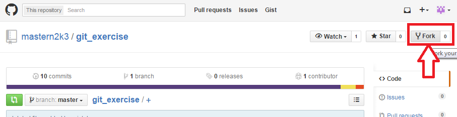
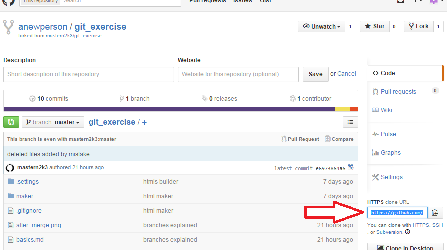

Working with Remotes
--------------------

For this exercise you're going to need a repo with write permissions, so in case you have one use it.
If not, in the next paragraph I'll show you how to fork the one I created in github so you could write to it.

### Forking a github repo

1. Create an account in [GitHub](https://github.com/).

2. Browse to https://github.com/mastern2k3/git_exercise and fork my repo:

	

3. Now that you have your own repo, you can use the http link below to upload changes:

	

	Should look something like this: `https://github.com/anewperson/git_exercise.git`

4. That's it! Now you have your own copy and you are ready to push changes to it.
