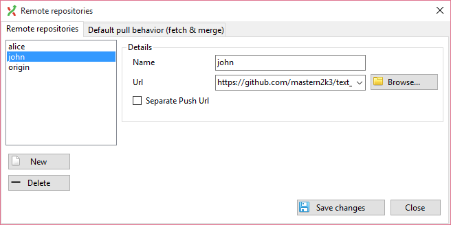
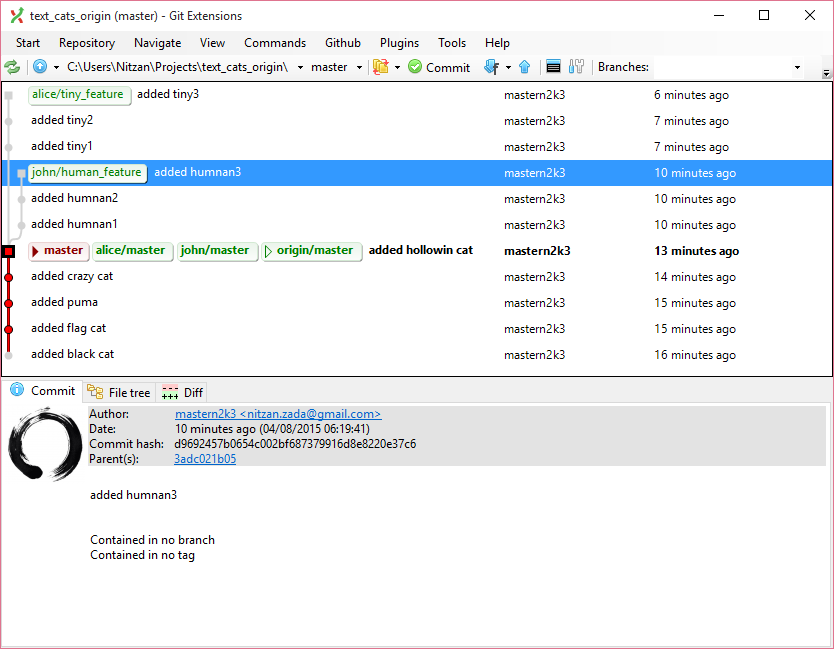

Remotes Scenarios
==================

Lets re-explore the work of the integrator, working with remotes and managing changes from other fork remotes.

### Merging two coworker repos and pushing to origin

1. Fork the three exercise repos, named:

    * `text_cats_origin`
    * `text_cats_john`
    * `text_cats_alice`

    These repos will simulate two remotes belonging to two coworkers and another that simulates the origin repo.

2. Clone the `text_cats_origin` locally.

3. Add John's and Alice's repos as remotes to your local clone.

    

4. Fetch their changes from all of their branches.  
    Should look like this:

    

5. Merge their changes found in the `human_feature` and `tiny_feature` branches to the `master` branch manually.
    You can use merge or cherry pick.

6. When their changes are set upon the `master` branch push the new changes to the origin repo.
