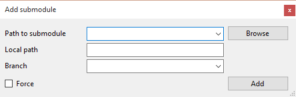
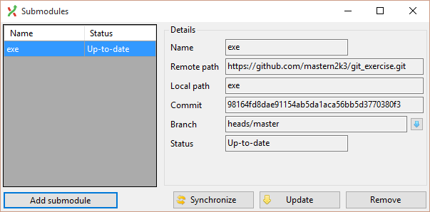
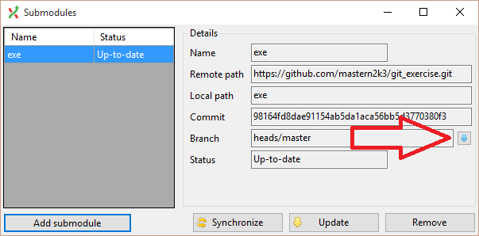

Working with Submodules
=======================

### Adding a submodule to an existing repo

For whenever you wish to have another repo as a part of your repo.

1. Initialize a new local empty repo.

2. Add some files to it, just to create an initial commit.

3. Add a new submodule connected to the exercise repo (`master` branch) in a subfolder named `exercise`.  
    Use "Repository" -> "Submodules..." -> "Add submodule".

    

4. Update the newly created submodule.  
    Use "Update"

    

4. Notice the new commit adding the new submodule changes.

5. Commit the new changes.

### Checking out the submodule to a specific commit

For whenever we need a specific version of a repository as a submodule.

1. Open the repo from the previous exercise.

2. Open the submodule's repo.

3. Check out a specific commit in the submodule repo.

4. Notice the changes in the super repo.

    

5. Commit the new changes.

### Pulling submodule changes

For whenever we need to fetch new changes that exist in the submodule's remote repo.

1. Open the repo from the previous exercise.

2. Open the repo's submodules window  
    Use "Repository" -> "Submodules..."

3. Use the pull button on the submodule we created earlier.

    

4. After the pull commit the new changes.
